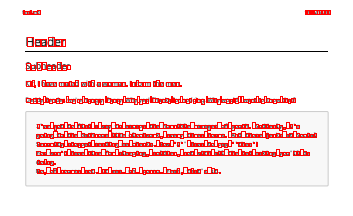

# docnet

## Description

**docnet** aims to be a fast PDF editing and data extraction library. It is a `.NET Standard 2.0` wrapper for `PDFium C++` library that is used by `chromium`.

PDFium version: `4194`

Supported platforms:

- win
- linux
- osx

## Features

- [x] Extract **PDF** version
- [x] Extract page count
- [x] Extract page information
   - [x] Get page width
   - [x] Get page height
   - [x] Get page text
   - [x] Get characters
   - [x] Get character boundaries
   - [x] Render page to image
- [x] Split **PDF** document
- [x] Merge **PDF** document
- [x] Unlock **PDF** document
- [x] Convert **JPEG** files to **PDF**

## Examples

* Render PDF page as PNG and display all character bounding boxes: [example](examples/nuget-usage/NugetUsageAnyCpu/PdfToImageExamples.cs)

   

    **Note:** If you have issues running on Linux make sure that `libgdiplus` is installed since this example uses `System.Drawing.Common`.

* Convert JPEG file to PDF: [example](examples/nuget-usage/NugetUsageAnyCpu/ImageToPdfExamples.cs)

## Usage

* DocLib.Instance should be treated as a singleton that lives as long as your application. It should only be disposed when you intend to clean all unmanaged resources of PDFium.
